[GETTING STARTED ARTICLE](asp-net-core/asp-net-core.md)

[CUSTOM METRICS](asp-net-core/custom-metrics.md)

# Azure Cafe Application Insights sample application

The Azure Cafe sample application demonstrates the implementation of Application Insights in an ASP.NET Core application.

- [Azure Cafe Application Insights sample application](#azure-cafe-application-insights-sample-application)
  - [Application architecture](#application-architecture)
  - [Prerequisites](#prerequisites)
  - [Deployment of the starter application](#deployment-of-the-starter-application)
    - [Deploy the supporting Azure resources](#deploy-the-supporting-azure-resources)
    - [Download application source code](#download-application-source-code)
    - [Deploy the database project](#deploy-the-database-project)
    - [Deploy the web application project](#deploy-the-web-application-project)
    - [Clean up](#clean-up)

## Application architecture

The Azure Cafe application consists of an ASP.NET Core web application that serves information about local cafes including reviews and menu items. A review consists of a name, rating (on a sale of 1-5), a description, and the option to upload an image. Cafe data is stored in an Azure SQL database and review images are stored in Azure Storage. When submitting a review, the application also interfaces with a Language Service to determine the review sentiment through Sentiment Analysis.


## Prerequisites

- [Visual Studio 2022](https://visualstudio.microsoft.com/vs/)
- Visual Studio Workloads: ASP.NET and web development, Data storage and processing, and Azure development
- Azure subscription and user account (with the ability to create and delete resources)

## Deployment of the starter application

Deploy the starter application solution when following the [Application Insights for ASP.NET Core applications](https://docs.microsoft.com/azure/azure-monitor/app/asp-net-core) article.

> [!TIP]
> If you wish to deploy the final version of the source code without running through the steps of the article, proceed with the following steps but utilize the `2 - Completed Application` folder instead.

### Deploy the supporting Azure resources

1. Sign into the [Azure Portal](https://portal.azure.com).

2. In the upper-right of the portal screen, open a cloud shell instance.

   

3. Choose **PowerShell** as the language. If prompted, create a cloud shell storage account.

   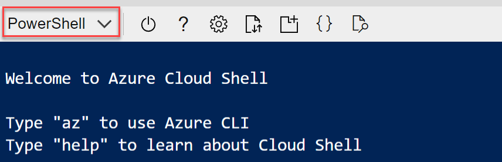

4. Create a user context by issuing the following command. Follow the prompts to authenticate with your Azure Portal credentials.

    ```powershell
    az login
    ```

5. Optionally, set the Azure Subscription using the following command, replacing SUBSCRIPTION_ID with the desired Azure Subscription ID value.

    ```powershell
    az account set --subscription SUBSCRIPTION_ID
    ```

    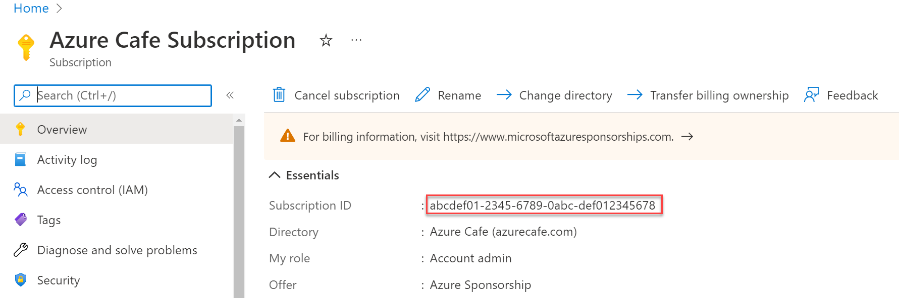

6. Clone the sample repository using the following command.

    ```powershell
    git clone https://github.com/solliancenet/appinsights-azurecafe.git
    ```

7. Navigate to the deployment directory with the following command.

    ```powershell
    cd "appinsights-azurecafe/1 - Starter Application/deployment"
    ```

8. Execute the following command to initiate the deployment.

   ```powershell
   terraform init
   ```

9. Perform the deployment using the following command.

    ```powershell
    terraform apply
    ```

10. When prompted, enter your IP address. You can retrieve this value by visiting [IP Chicken](https://ipchicken.com).

    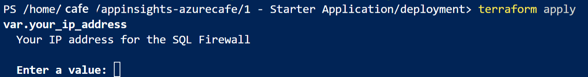

11. When the list of resources to be deployed displays, type `yes` and press <kbd>Enter</kbd> to continue.

    

12. Deployment will take up to 5 minutes to complete. Once completed, retrieve the Azure SQL password by executing the following command. Record this value for use when deploying the database project.

    ```powershell
    terraform output sql_server_password
    ```

### Download application source code

1. In a web browser, visit the [source code repository page](https://github.com/solliancenet/appinsights-azurecafe) on GitHub.

2. Expand the **Code** button, and select the **Download ZIP** option.

3. Extract the ZIP archive to the desired working directory.

    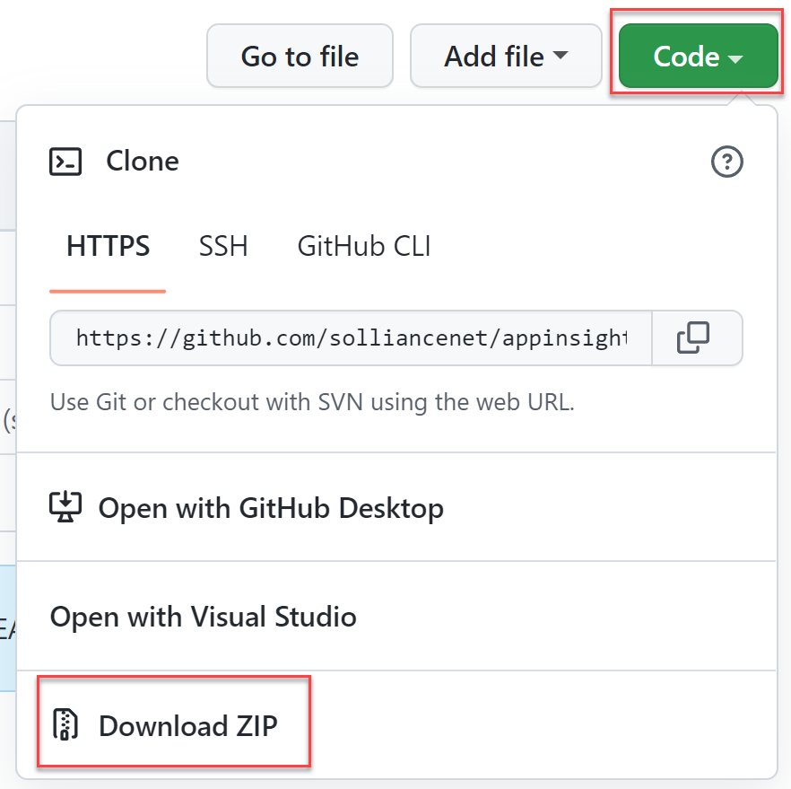

### Deploy the database project

1. Use Visual Studio to open the `\1 - Starter Application\database\AzureCafeSqlDatabase.sln` file from the extracted ZIP. Ensure you are logged into Visual Studio with the same account as your Azure Portal account.

2. In the **Solution Explorer** panel, right-click the **AzureCafeSqlDatabase** project and select **Publish**.

   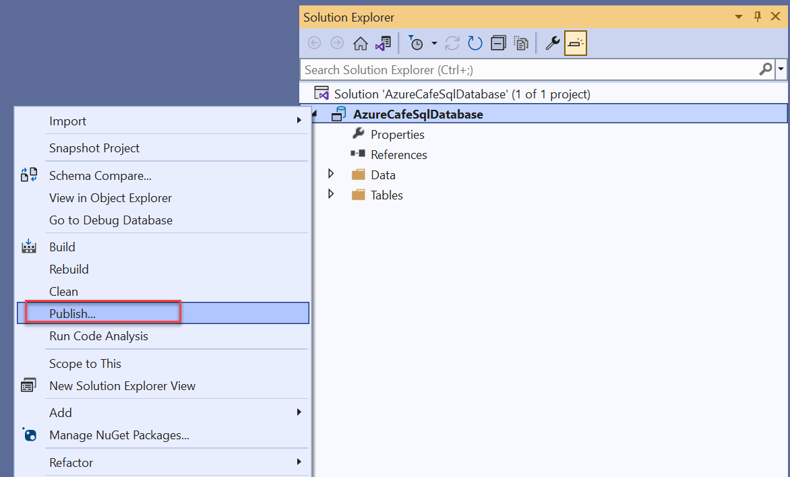

3. In the **Publish Database** dialog, select the **Edit** button next to the **Target database connection** field.

    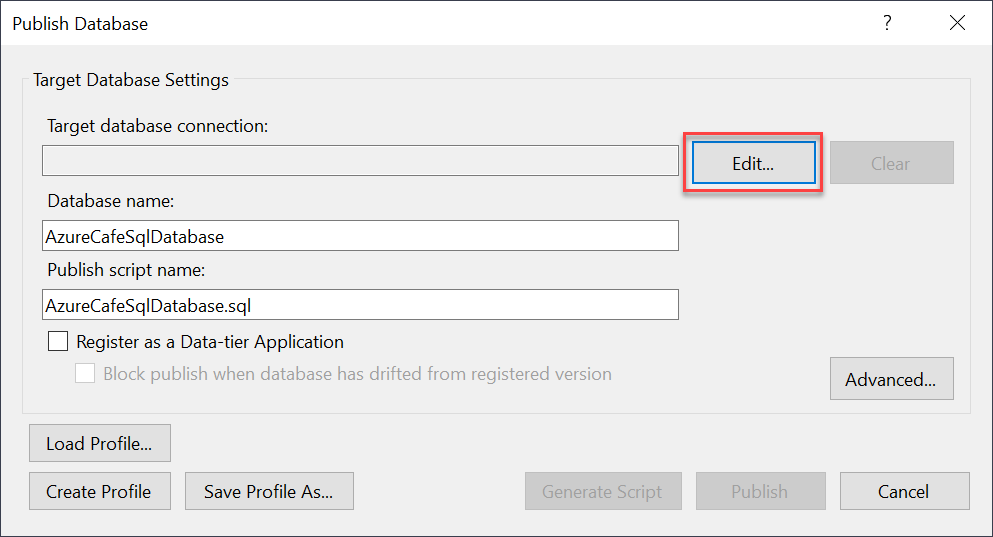

4. In the **Connect** dialog, select the **Browse** tab. Expand the **Azure** section, and locate and select the **AzureCafeSqlDatabase** item. In the bottom panel, enter the password that was recorded when deploying the Azure resources. Select **OK**.

    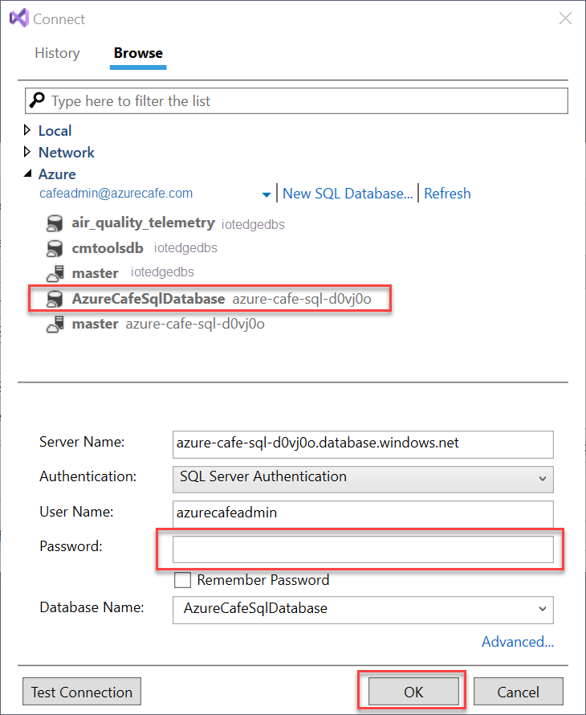

5. On the **Publish Database** dialog, select the **Publish** button.

    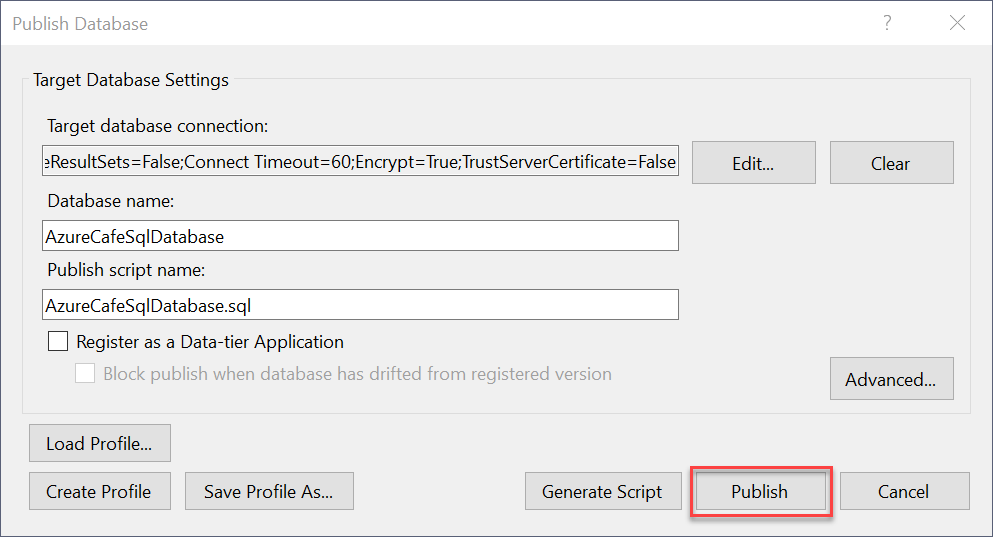

6. Wait a few minutes while the database project is deployed. Once completed, close Visual Studio.

    

### Deploy the web application project

1. Use Visual Studio to open the `\1 - Starter Application\src\AzureCafe.sln` file from the extracted ZIP. Ensure you are logged into Visual Studio with the same account as your Azure Portal account.

2. In the **Solution Explorer** panel, right-click the **AzureCafe** project and select **Publish**.

    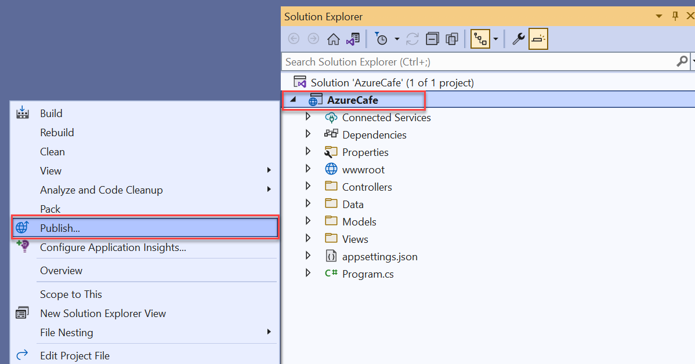

3. In the **Publish** dialog **Target** step, select **Azure**, then **Next**.

    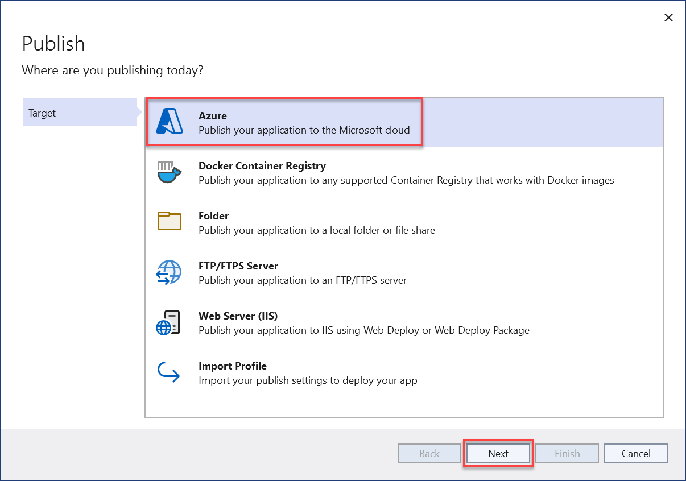

4. In the **Publish** dialog **Specific target** step, select **Azure App Service (Windows)**. Select **Next**.

    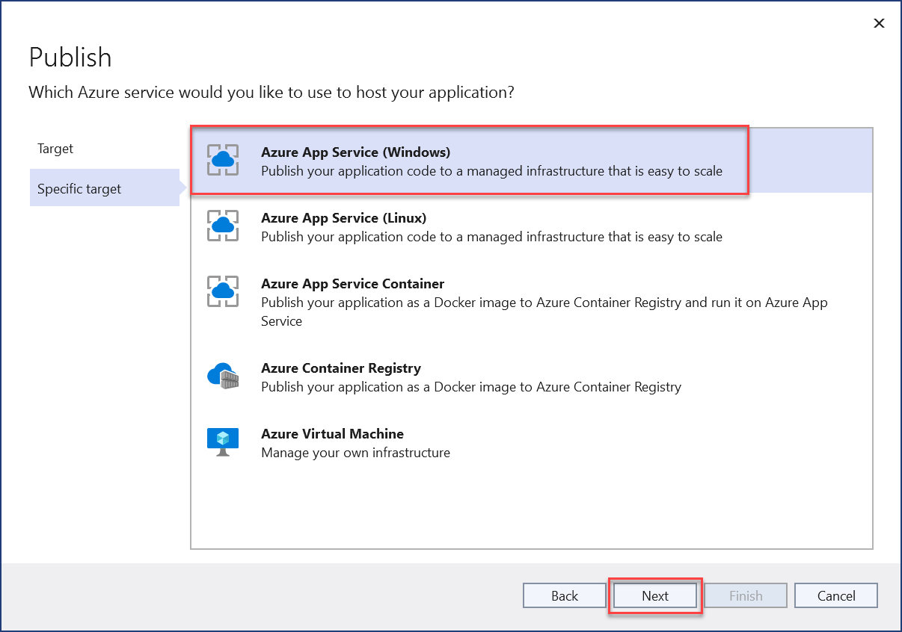

5. In the **Publish** dialog **App Service** step, select the **azure-dave-web-{suffix}** item, then select **Finish**.

    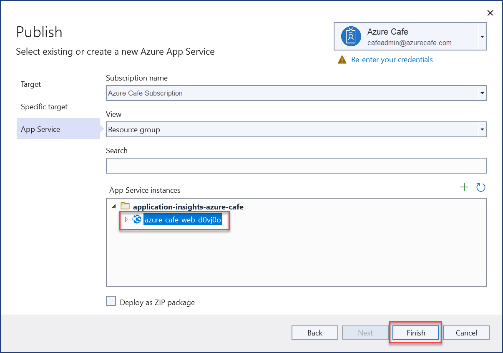

6. On the created publish profile, select the **Publish** button.

    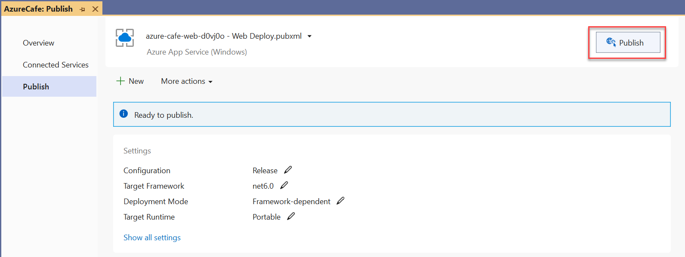

7. Once publishing has succeeded, a browser window displays with the web application.

    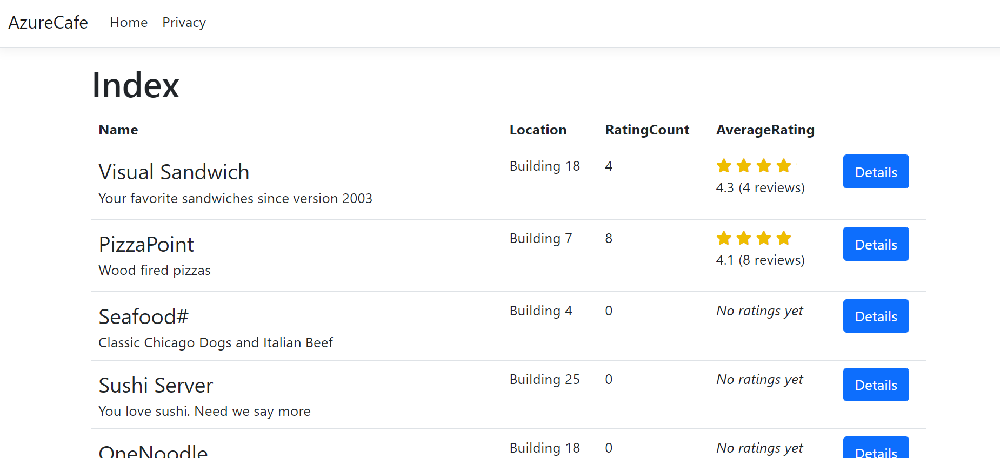

8. Return to the [Application Insights for ASP.NET Core applications](https://docs.microsoft.com/azure/azure-monitor/app/asp-net-core) article and learn to implement Application Insights.

### Clean up

When you have completed following along with the article, clean up all deployed resources.

1. Log into the [Azure Portal](https://portal.azure.com), and open a Cloud Shell instance. Select the **PowerShell** language.

2. Establish a user context by executing the following command. Follow the prompts to authenticate.

    ```powershell
    az login
    ```

3. Optionally, set the Azure Subscription using the following command, replacing SUBSCRIPTION_ID with the desired Azure Subscription ID value.

    ```powershell
    az account set --subscription SUBSCRIPTION_ID
    ```

4. Navigate to the deployment directory with the following command.

    ```powershell
    cd "appinsights-azurecafe/1 - Starter Application/deployment"
    ```

5. Remove all deployed resources by executing the following command, when prompted to continue, enter `yes`.

    ```powershell
    terraform destroy
    ```

6. Once completed. Execute the following command 3 times to return to the user directory.

    ```powershell
    cd..
    ```

7. Remove the cloned git repository by issuing the following command.

    ```powershell
    Remove-Item appinsights-azurecafe -recurse -force
    ```
